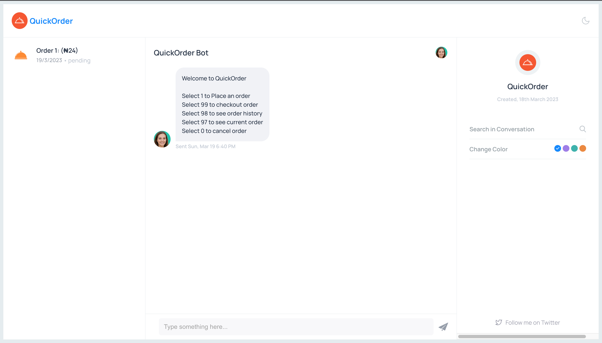
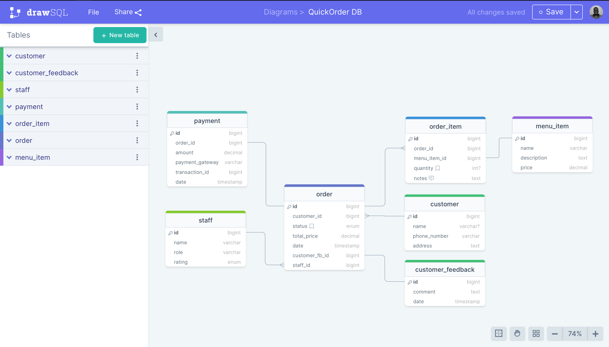

# Altschool QuickOrder ChatBot



This is a chatbot application built to assist customers in placing orders for their preferred meals in a restaurant.

The chatbot interface is designed to look and function like a chat interface. The application doesn't require authentication, but user sessions will be stored based on their devices.

## Base URL

- [https://altschool-quickorder.onrender.com](https://altschool-quickorder.onrender.com)

## Socket Features

1. A user can select different options from the chatbot interface
2. When a customer lands on the chatbot page, the bot should send these options to the customer:
   - Select 1 to Place an order
   - Select 99 to checkout order
   - Select 98 to see order history
   - Select 97 to see current order
   - Select 0 to cancel order

3. When a customer selects `1`, the bot should return a list of items from the restaurant. The order items can have multiple options but the customer should be able to select the preferred items from the list using this same number select system and place an order.
4. When a customer selects `99`, the bot should respond with "order placed" and if none the bot should respond with "No order to place". The customer should also see an option to place a new order.
5. When a customer selects `98`, the bot should be able to return all placed orders.
6. When a customer selects `97`, the bot should be able to return the current order.
7. When a customer selects `0`, the bot should cancel the order if there is any.

## Installation

1. Clone the repository to your local machine
   ```
   git clone https://github.com/davidudo/altschool-nodejs_semester3-exam
   ```
2. Install the required dependencies by running the command npm install
   ```
   npm install
   ```
3. Add your `.env` file in the root directory and assifn values to the following variables
   ```
   PORT
   HOST
   PGHOST
   PGDATABASE
   PGUSER
   PGPASSWORD
   ENDPOINT_ID
   ```
4. Run the command npm start to start the application
   ```
   npm run start
   ```
5. To run typescript to javascript build command
   ```
   npm run build
   ```
6. To seed database
   ```
   npm run populate
   ```
7. To destroy all data in database
   ```
   npm run destroy
   ```

## Tech Stack

The application was built using the following technologies:

- Node.js
- Express
- TypeScript
- Socket.io
- Sequelize
- PostgreSQL
- ESLint (for TypeScript)

## Hosting

- Frontend ==> Vercel
- Backend ==> Render
- Database ==> Neon.tech

## Database Design



## Models

### Customer
|  field     |  data_type |  constraints  |
|---         |---         |---          |
|  id        |  number  |  required     |
|  imageUrl |  string or null   |  optional     |
|  name  |  string or null   |  optional     |
|  email     |  string or null   |  optional     |
|  phoneNumber  |  string or null    |  optional     |


### Staff
|  field     |  data_type |  constraints  |
|---         |---         |---          |
|  id        |  number  |  required     |
|  imageUrl |  string   |  required     |
|  name  |  string  |  required     |
|  email     |  string  |  required    |
|  rating  |  string   |  optional     |

### Customer Feedback
|  field     |  data_type |  constraints  |
|---         |---         |---          |
|  id        |  number  |  required     |
|  comment |  string   |  optional     |

### Menu Item
|  field     |  data_type |  constraints  |
|---         |---         |---          |
|  id        |  number  |  required     |
|  imageUrl |  string or null  |  optional     |
|  name  |  string  |  required     |
|  description     |  string or null |  optional    |
|  price  |  string   |  required     |

### Order Item
|  field     |  data_type |  constraints  |
|---         |---         |---          |
|  id        |  number  |  required     |
|  orderId |  number   |  required     |
|  menuItemId  |  number  |  required     |
|  quantity     |  number  |  required    |
|  notes |  string or null  |  optional     |

### Order
|  field     |  data_type |  constraints  |
|---         |---         |---          |
|  id        |  number  |  required     |
|  customerId |  number   |  required     |
|  customerFBId  |  number or null  |  optional     |
|  staffId     |  number  |  required    |
|  status |  string  |  required     |
|  totalPrice |  number  |  required     |

### Payment Gateway
|  field     |  data_type |  constraints  |
|---         |---         |---          |
|  id        |  number  |  required     |
|  orderId |  number   |  required     |
|  amount  |  number |  required    |
|  paymentGateway     |  number  |  required    |

## APIs

### Get All Orders

- Route: /api/v1/order
- Method: GET

### Make An Order
- Route: /api/v1/order
- Method: POST
- Body: 
  
    ```json
    {
      "customer": {
        "id": "1"
      },
      "order": {
        "totalPrice": 4000,
          "orderItems": [
            {
              "menuItem": {
                "id": 1
              },
              "quantity": 1,
              "notes": "Extra spicy"
            },
            {
              "menuItem": {
                "id": 2
              },
              "quantity": 2,
              "notes": "Extra spicy"
            }
          ]
      },
      "customerFeedback": {
        "comment": "Good food"
      }
    }
    ```

### Get Order By Id

- Route: /api/v1/order/:id
- Method: GET

### Delete Order By Id

- Route: /api/v1/order/:id
- Method: DELETE

### Get All Customers

- Route: /api/v1/customer
- Method: GET

### Get Customer By Id

- Route: /api/v1/customer/:id
- Method: GET

### Create Customer
- Route: /api/v1/customer
- Method: POST
- Body: 
  
    ```json
    {
      "name": "Onana Colman",
      "email": "onana@gmail.com",
      "phoneNumber": "08057104772"
   }
    ```

### Delete Customer By Id

- Route: /api/v1/customer/:id
- Method: DELETE

### Get All Staffs

- Route: /api/v1/Staff
- Method: GET

### Get Staff By Id

- Route: /api/v1/Staff/:id
- Method: GET

### Create Staff
- Route: /api/v1/Staff
- Method: POST
- Body: 
  
    ```json
    {
      "name": "Onana Colman",
      "email": "onana@gmail.com",
      "role": "delivery"
   }
    ```

### Delete Staff By Id

- Route: /api/v1/Staff/:id
- Method: DELETE

## Contributor

- David Udo